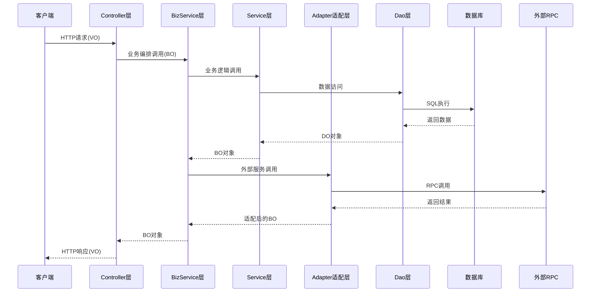
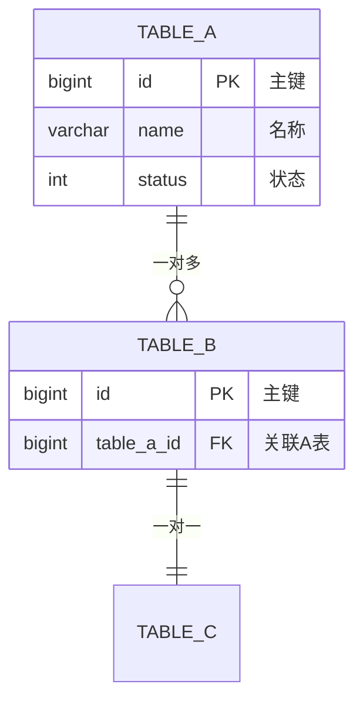
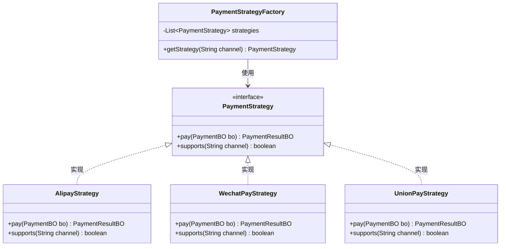
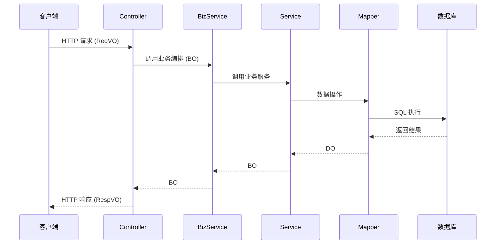

# 技术方案设计（架构需求文档 → 技术方案文档）

## 概述

基于架构需求文档，生成详细的技术方案文档，为代码生成提供完整的技术指导。

---

## 输入要求

- 已确认的架构需求文档

---

## 图表输出要求（必须遵循）

技术方案文档中必须包含以下图表，确保设计可视化：

| 图表类型 | 格式 | 必须/可选 | 适用场景 |
|----------|------|----------|----------|
| 整体架构图 | sequenceDiagram | 必须 | 展示系统分层调用关系 |
| 核心流程图 | sequenceDiagram | 必须 | 每个核心业务流程 |
| ER 实体关系图 | erDiagram | 必须 | 展示表与表之间的关系 |
| 状态机图 | stateDiagram-v2 | 可选 | 有状态流转的业务 |
| UML 类图 | classDiagram | 可选 | 策略模式、扩展点等多选一场景 |

**图表规范**：
1. 所有流程图必须使用 `sequenceDiagram` 格式
2. 状态机可使用 `stateDiagram-v2` 格式
3. ER 图必须包含字段定义和关系说明
4. 存在策略/扩展点场景时，必须输出 UML 类图

---

## 输出：技术方案文档

### 1. 整体架构图

> 所有架构图必须使用 sequenceDiagram 格式



### 2. 模块拆分

#### 2.1 拆分依据
| 拆分维度 | 说明 |
|----------|------|
| 业务边界 | 按业务领域划分 |
| 职责单一 | 每个模块职责明确 |
| 依赖方向 | 上层依赖下层，避免循环 |
| 复用性 | 公共能力下沉 |

#### 2.2 模块详情
| 模块 | 职责 | 依赖模块 | 对外能力 |
|------|------|----------|----------|
| {MODULE}-dao | 数据访问 | - | DO、Mapper |
| {MODULE}-core | 核心业务 | dao | Service、BO |
| {MODULE}-interfaces | Web 接口 | core | Controller、VO |
| {MODULE}-api | RPC 接口 | core | RPC Service、TO |

### 3. 数据模型设计

#### 3.1 表结构设计
```sql
-- 表名: [table_name]
-- 描述: [表描述]
CREATE TABLE `table_name` (
    `id` BIGINT UNSIGNED NOT NULL AUTO_INCREMENT COMMENT '主键ID',
    `field_name` VARCHAR(64) NOT NULL DEFAULT '' COMMENT '字段描述',
    `status` TINYINT NOT NULL DEFAULT 0 COMMENT '状态: 0-初始, 1-处理中, 2-成功, 3-失败',
    `create_time` DATETIME NOT NULL DEFAULT CURRENT_TIMESTAMP COMMENT '创建时间',
    `update_time` DATETIME NOT NULL DEFAULT CURRENT_TIMESTAMP ON UPDATE CURRENT_TIMESTAMP COMMENT '更新时间',
    `is_deleted` TINYINT NOT NULL DEFAULT 0 COMMENT '是否删除: 0-否, 1-是',
    PRIMARY KEY (`id`),
    KEY `idx_field_name` (`field_name`)
) ENGINE=InnoDB DEFAULT CHARSET=utf8mb4 COMMENT='表描述';
```

#### 3.2 实体关系图（ER 图）

> 必须输出 ER 图，展示表与表之间的关系



**ER 图关系符号说明**：
| 符号 | 含义 |
|------|------|
| `\|\|--o{` | 一对多 |
| `\|\|--\|\|` | 一对一 |
| `o{--o{` | 多对多 |
| `PK` | 主键 |
| `FK` | 外键 |

#### 3.3 索引设计
| 表名 | 索引名 | 索引字段 | 索引类型 | 用途 |
|------|--------|----------|----------|------|
| table_name | idx_field | field_name | 普通索引 | 查询优化 |

### 4. 代码结构设计

#### 4.1 包结构

> Core 层 Service 不需要 interface + impl 结构，直接使用 Service 类

```
{BASE_PACKAGE}
├── dao
│   └── [module]
│       ├── entity          # DO 实体
│       ├── mapper          # Mapper 接口
│       └── enums           # 数据层枚举
├── core
│   └── [module]
│       ├── bo              # 业务对象
│       ├── enums           # 业务枚举
│       ├── contracts/      # 契约/接口定义（策略接口、扩展点）
│       ├── validate/       # 校验逻辑
│       ├── adapter/        # 外部服务适配器
│       ├── service/        # 子模块 Service
│       │   └── [子模块]Service.java
│       ├── [Module]Service.java       # 应用层（对外统一入口）
│       ├── [Module]BaseService.java   # 基础层（通用能力）
│       └── [Module]BizService.java    # 业务编排
├── interfaces
│   └── controller
│       └── [module]
│           ├── vo
│           │   ├── req     # 请求 VO
│           │   └── resp    # 响应 VO
│           └── [Module]Controller.java
└── api
    ├── model/              # TO 对象
    ├── enums/              # 接口枚举
    └── service/            # RPC 接口定义
        └── [Module]Rpc.java
```

#### 4.2 类设计清单

| 层级 | 类名 | 类型 | 职责 | 依赖 |
|------|------|------|------|------|
| DAO | XxxDO | Entity | 数据实体 | - |
| DAO | XxxMapper | Interface | 数据访问 | XxxDO |
| Core | XxxBO | BO | 业务对象 | - |
| Core | XxxService | Class | 应用层服务（对外统一入口） | XxxBaseService, 子模块Service |
| Core | XxxBaseService | Class | 基础层服务（通用能力） | XxxMapper |
| Core | Xxx子模块Service | Class | 核心业务服务 | XxxBaseService |
| Core | XxxAdapter | Class | 外部服务适配器 | 外部RPC |
| Core | XxxBizService | Class | 业务编排 | XxxService |
| Interfaces | XxxReqVO | VO | 请求对象 | - |
| Interfaces | XxxRespVO | VO | 响应对象 | - |
| Interfaces | XxxController | Controller | Web 接口 | XxxBizService |
| API | XxxTO | TO | 传输对象 | - |
| API | XxxRpc | Interface | RPC 接口定义 | - |

#### 4.3 UML 类关系图（如有策略/扩展点场景）

> 当存在「多选一」策略场景时，必须输出 UML 类图展示策略接口与实现类的关系

**策略模式示例**（多选一场景）：



**适用场景**：
| 场景 | 说明 | 是否需要 UML 图 |
|------|------|----------------|
| 多选一策略 | 支付渠道、发票平台、通知方式等 | ✅ 必须 |
| 扩展点预留 | 未来可能新增实现的接口 | ✅ 必须 |
| 简单依赖 | 普通 Service 调用 | ❌ 不需要 |

**UML 类图符号说明**：
| 符号 | 含义 |
|------|------|
| `<<interface>>` | 接口 |
| `<\|..` | 实现关系 |
| `<\|--` | 继承关系 |
| `-->` | 依赖/使用关系 |
| `--o` | 聚合关系 |
| `--*` | 组合关系 |

### 5. 数据流向（核心流程）



### 6. 接口/函数设计

#### 6.1 Controller 接口
| 接口路径 | 方法 | 描述 | 请求参数 | 响应参数 |
|----------|------|------|----------|----------|
| /api/v1/xxx | POST | 创建 | XxxCreateReqVO | XxxRespVO |
| /api/v1/xxx/{id} | GET | 查询 | id | XxxRespVO |
| /api/v1/xxx/{id} | PUT | 更新 | XxxUpdateReqVO | XxxRespVO |
| /api/v1/xxx/{id} | DELETE | 删除 | id | Boolean |

#### 6.2 Service 方法
| 方法名 | 描述 | 入参 | 出参 | 异常 |
|--------|------|------|------|------|
| create | 创建 | XxxBO | XxxBO | BizException |
| getById | 查询 | Long | XxxBO | - |
| update | 更新 | XxxBO | XxxBO | BizException |
| delete | 删除 | Long | Boolean | BizException |

#### 6.3 RPC 接口（如需）
| 接口名 | 方法 | 描述 | 入参 | 出参 |
|--------|------|------|------|------|
| XxxRpcService | create | 创建 | XxxTO | Result<XxxTO> |

### 7. 外部依赖清单

#### 7.1 服务依赖（二方服务/本工程内部服务）

> 说明：依赖可能是外部 RPC 服务，也可能是本工程内部其他模块的服务，统一使用「类全路径 + 方法」描述

| 依赖名称 | Adapter类 | 类全路径 | 方法签名 | 入参 | 出参 | 用途 | 状态 |
|----------|-----------|----------|----------|------|------|------|------|
| 示例服务 | XxxAdapter | com.dahuangf.xxx.XxxService | queryById(Long id) | Long | XxxBO | 用途描述 | ⏳ 待确认 |
| 本工程服务 | - | {BASE_PACKAGE}.core.xxx.XxxService | getDetail(Long id) | Long | XxxBO | 用途描述 | ✅ 已确认 |

**依赖类型说明**：
- 外部 RPC 服务：需要通过 Adapter 封装调用
- 本工程内部服务：直接注入调用，无需 Adapter

#### 7.2 三方 API 依赖
| 依赖名称 | 接口地址 | 方法 | 用途 | 对接文档 | 状态 |
|----------|----------|------|------|----------|------|
| 示例API | https://api.xxx.com | POST | 用途描述 | [链接] | 待确认 |

**状态说明**：
- ✅ 已确认：接口信息完整，可直接对接
- ⏳ 待确认：需要用户提供接口信息
- 🔲 预留TODO：用户无法提供，代码中预留 TODO

### 8. 核心流程实现细节

#### 8.1 流程：[流程名称]
```
1. 参数校验
   - 校验项1
   - 校验项2

2. 业务处理
   - 步骤1：描述
   - 步骤2：描述

3. 数据持久化
   - 操作1：描述

4. 后置处理
   - 事件发布
   - 缓存更新
```

#### 8.2 异常处理
| 异常场景 | 异常类型 | 错误码 | 处理方式 |
|----------|----------|--------|----------|
| 参数校验失败 | ParamException | 400xxx | 返回错误信息 |
| 业务校验失败 | BizException | 500xxx | 返回错误信息 |
| 系统异常 | SystemException | 999xxx | 记录日志，返回通用错误 |

### 9. 测试与验证要求

#### 9.1 单元测试
| 测试类 | 测试方法 | 测试场景 | 预期结果 |
|--------|----------|----------|----------|
| XxxServiceTest | testCreate | 正常创建 | 创建成功 |
| XxxServiceTest | testCreate_paramError | 参数错误 | 抛出异常 |

#### 9.2 集成测试
| 测试场景 | 测试步骤 | 预期结果 |
|----------|----------|----------|
| 完整流程 | 1. 创建 2. 查询 3. 更新 | 数据一致 |

### 10. 预生成代码清单

#### 10.1 DAO 层
| 文件路径 | 类型 | 描述 |
|----------|------|------|
| dao/[module]/entity/XxxDO.java | Entity | 数据实体 |
| dao/[module]/mapper/XxxMapper.java | Interface | Mapper 接口 |
| resources/mapper/[module]/XxxMapper.xml | XML | Mapper XML |

#### 10.2 Core 层

> Core 层 Service 不需要 interface + impl 结构，直接使用 Service 类

| 文件路径 | 类型 | 描述 |
|----------|------|------|
| core/[module]/bo/XxxBO.java | BO | 业务对象 |
| core/[module]/enums/XxxStatusEnum.java | Enum | 状态枚举 |
| core/[module]/[Module]Service.java | Class | 应用层服务（对外统一入口） |
| core/[module]/[Module]BaseService.java | Class | 基础层服务（通用能力封装） |
| core/[module]/[Module]AdapterService.java | Class | 适配层服务（外部系统对接，如有） |
| core/[module]/service/[子模块]Service.java | Class | 子模块核心业务服务 |
| core/[module]/[Module]BizService.java | Class | 业务编排 |
| core/[module]/adapter/XxxAdapter.java | Class | 外部服务适配器（如有） |
| core/[module]/contracts/XxxStrategy.java | Interface | 策略接口（如有） |
| core/[module]/validate/XxxValidator.java | Class | 校验逻辑（如有） |

#### 10.3 Interfaces 层
| 文件路径 | 类型 | 描述 |
|----------|------|------|
| interfaces/controller/[module]/vo/req/XxxReqVO.java | VO | 请求对象 |
| interfaces/controller/[module]/vo/resp/XxxRespVO.java | VO | 响应对象 |
| interfaces/controller/[module]/XxxController.java | Controller | 控制器 |

#### 10.4 API 层（如需）
| 文件路径 | 类型 | 描述 |
|----------|------|------|
| api/model/XxxTO.java | TO | 传输对象 |
| api/enums/XxxEnum.java | Enum | 接口枚举（如需对外提供） |
| api/service/XxxRpc.java | Interface | RPC 接口定义 |

---

## 确认清单

完成技术方案文档后，需要与用户确认以下内容：

- [ ] 整体架构是否合理？
- [ ] 模块拆分是否清晰？
- [ ] 数据模型设计是否正确？
- [ ] 接口设计是否完整？
- [ ] 外部依赖是否明确？（需要用户补充信息）
- [ ] 预生成代码清单是否完整？

**确认后询问**: "技术方案文档已完成，是否确认开始生成代码？将按照 DAO → Core → Interfaces → API 的顺序逐层生成。"
