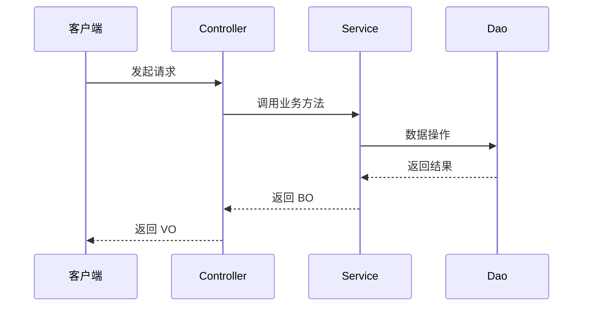

# 全局命名规范汇总

## 项目变量说明

本规范使用以下变量，根据当前项目自动替换：
- `{MODULE}`: 模块名（finance 或 sale）
- `{MODULE_PASCAL}`: 模块名大驼峰形式（Finance 或 Sale）
- `{BASE_PACKAGE}`: 基础包路径（com.dahuangf.finance 或 com.dahuangf.sale）

---

## 命名规范总表

| 类型 | 规则 | 示例（finance） | 示例（sale） |
|------|------|-----------------|--------------|
| 数据库表 | {MODULE}_ + 业务语义（下划线分隔） | finance_invoice_apply | sale_quotation_main |
| DO | {MODULE_PASCAL} + 业务语义 + DO | FinanceInvoiceApplyDO | SaleQuotationMainDO |
| Dao | {MODULE_PASCAL} + 业务语义 + Dao | FinanceInvoiceApplyDao | SaleQuotationMainDao |
| Mapper | {MODULE_PASCAL} + 业务语义 + Mapper | FinanceInvoiceApplyMapper | SaleQuotationMainMapper |
| BO | 业务语义 + BO（无前缀） | InvoiceApplyBO | QuotationMainBO |
| TO/DTO | 业务名 + TO/DTO（无前缀） | InvoiceTO | QuotationTO |
| 分页查询 VO | 业务名 + PageReqVO（无前缀） | InvoicePageReqVO | QuotationPageReqVO |
| 新增 VO | 业务名 + CreateReqVO（无前缀） | InvoiceCreateReqVO | QuotationCreateReqVO |
| 更新 VO | 业务名 + UpdateReqVO（无前缀） | InvoiceUpdateReqVO | QuotationUpdateReqVO |
| 响应 VO | 业务名 + RespVO（无前缀） | InvoiceRespVO | QuotationRespVO |
| 枚举 | 大驼峰 + Enum（无前缀） | InvoiceTypeEnum | QuotationStatusEnum |
| 契约接口 | 大驼峰 + Strategy/Handler/Service（无前缀） | PaymentStrategy | PricingStrategy |
| 对外 Service | 业务域 + Service（无前缀） | InvoiceService | QuotationService |
| 子模块 Service | 子功能 + Service（无前缀） | InvoiceIssueService | QuotationPriceService |
| Controller | 业务名 + Controller（无前缀） | InvoiceController | QuotationController |
| RPC 接口 | 业务名 + Rpc（无前缀） | InvoiceRpc | QuotationRpc |
| RPC 实现 | RPC接口 + Impl（无前缀） | InvoiceRpcImpl | QuotationRpcImpl |
| 工厂类 | 业务名 + Factory（无前缀） | PaymentFactory | PricingFactory |

---

## 前缀规则说明（重要）

### 需要添加 {MODULE_PASCAL} 前缀的类型

以下类型必须添加模块前缀（大驼峰形式）：

| 类型 | 前缀规则 | 原因 |
|------|----------|------|
| 数据库表 | `{MODULE}_` | 区分不同模块的表，避免表名冲突 |
| DO | `{MODULE_PASCAL}` | 与数据库表对应，保持一致性 |
| Dao | `{MODULE_PASCAL}` | 与 DO 对应，保持一致性 |
| Mapper | `{MODULE_PASCAL}` | 与 DO 对应，保持一致性 |

### 不需要前缀的类型

以下类型不添加模块前缀：

| 类型 | 原因 |
|------|------|
| BO | 业务对象，模块内部使用，无需区分 |
| TO/DTO | 传输对象，通过包路径区分模块 |
| VO | 视图对象，通过包路径区分模块 |
| Service | 服务类，通过包路径区分模块 |
| Controller | 控制器，通过包路径区分模块 |
| Enum | 枚举类，通过包路径区分模块 |
| 其他 | 通过包路径区分模块 |

### 命名示例对照

以 sale-platform 项目的报价单功能为例：

```
数据库表:     sale_quotation_main
DO:          SaleQuotationMainDO
Dao:         SaleQuotationMainDao
Mapper:      SaleQuotationMainMapper
BO:          QuotationMainBO          ← 无前缀
Service:     QuotationMainService     ← 无前缀
Controller:  QuotationController      ← 无前缀
VO:          QuotationCreateReqVO     ← 无前缀
Enum:        QuotationStatusEnum      ← 无前缀
```

---

## DO/BO/TO/VO 字段一致性规范（强制遵循）

### 核心原则

**排除继承父类属性后，DO、BO、TO、VO 的业务字段必须完全一致**，仅允许以下差异：

| 对象类型 | 允许的个性化字段 | 说明 |
|----------|------------------|------|
| DO | 无 | 与数据库表字段一一对应 |
| BO | 无 | 与 DO 字段完全一致 |
| TO | 无 | 与 BO 字段完全一致（用于 RPC 传输） |
| PageReqVO | 时间范围查询字段 | `createdAtStart`、`createdAtEnd` 等 |
| CreateReqVO | 无 | 与 BO 业务字段一致（排除 id、审计字段） |
| UpdateReqVO | id | 继承 CreateReqVO，新增 `@NotNull id` |
| RespVO | 审计字段 | `id`、`createdAt`、`createdBy`、`updatedAt`、`updatedBy` |

### 字段流转示意

```
Controller 层                    Service 层                    Dao 层
┌─────────────┐                 ┌─────────────┐              ┌─────────────┐
│ CreateReqVO │ ─────────────▶ │ VO → BO     │ ──CopyUtil──▶│     DO      │
│ UpdateReqVO │                 │     BO      │              │             │
└─────────────┘                 └─────────────┘              └─────────────┘
                                      │
┌─────────────┐                       │
│   RespVO    │ ◀──CopyUtil───────────┘
└─────────────┘
```

### 转换规则

| 转换场景 | 转换位置 | 工具 |
|----------|----------|------|
| VO → BO | Service 层 | `CopyUtil.copyBean` |
| BO → DO | Service 层 | `CopyUtil.copyBean` |
| DO → BO | Service 层 | `CopyUtil.copyBean` / `CopyUtil.copyPageInfo` |
| BO → VO | Controller 层 | `CopyUtil.copyBean` / `CopyUtil.copyPageInfo` |

---

## Controller 与 Service 方法对应规范（强制遵循）

### 默认 CRUD 方法必须一一对应（方法名一致）

| Controller 方法 | Service 方法 | Service 入参 | Service 出参 |
|-----------------|--------------|--------------|--------------|
| `page` | `page` | `PageParam`, `LambdaQueryWrapper<XxxDO>` | `IPage<XxxBO>` |
| `detail` | `detail` | `Long id` | `XxxBO` |
| `add` | `add` | `XxxCreateReqVO` | `int` |
| `update` | `update` | `XxxUpdateReqVO` | `int` |
| `delete` | `delete` | `Long id` | `int` |

### Controller 层职责

1. **参数校验**: `@Validated`、`@NotNull`
2. **page 方法**: 接收一个 VO 参数（继承 PageParam），调用 `reqVO.toLambdaQueryWrapper()` 生成查询条件，调用 Service 时传入两个参数
3. **其他方法**: 直接传入 VO，Service 层负责 VO → BO 转换
4. **BO → VO 转换**: Service 返回后完成
5. **统一返回**: 包装为 `BaseResult`

```java
@GetMapping("/page")
public BaseResult<IPage<UserRespVO>> page(UserPageReqVO reqVO) {
    // PageReqVO 继承 PageParam，调用 toLambdaQueryWrapper() 生成查询条件
    LambdaQueryWrapper<UserDO> queryWrapper = reqVO.toLambdaQueryWrapper();
    IPage<UserBO> boPage = userService.page(reqVO, queryWrapper);  // reqVO 作为 PageParam
    IPage<UserRespVO> voPage = CopyUtil.copyPageInfo(boPage, UserRespVO.class);
    return BaseResult.success(voPage);
}

@PostMapping("/add")
public BaseResult<Integer> add(@RequestBody @Validated UserCreateReqVO reqVO) {
    int count = userService.add(reqVO);  // 直接传入 VO
    return BaseResult.success(count);
}
```

### Service 层职责

1. **page 方法**: 直接接收 `LambdaQueryWrapper` 参数
2. **其他方法**: VO → BO 转换在入口处完成
3. **业务逻辑处理**: 使用 BO 进行业务操作
4. **BO → DO 转换**: 持久化前完成

```java
/**
 * 分页查询用户列表
 */
public IPage<UserBO> page(PageParam pageParam, LambdaQueryWrapper<UserDO> queryWrapper) {
    IPage<UserDO> doPage = userDao.page(pageParam.getPage(), queryWrapper);
    return CopyUtil.copyPageInfo(doPage, UserBO.class);
}

/**
 * 新增用户
 */
public int add(UserCreateReqVO reqVO) {
    UserBO bo = CopyUtil.copyBean(reqVO, UserBO.class);  // VO → BO
    UserDO userDO = CopyUtil.copyBean(bo, UserDO.class); // BO → DO
    return userDao.save(userDO) ? 1 : 0;
}
```

**关键说明**: `PageReqVO` 必须实现 `IQuery` 接口，该接口提供 `toLambdaQueryWrapper()` 方法，根据字段上的 `@Condition` 注解自动生成查询条件。


---

## 外部三方 API 调用规范

### 适配层预留 TODO

调用外部三方 API 时，适配层方法体预留 `// TODO` 注释，由人工实现具体对接逻辑：

```java
/**
 * 调用百旺云平台开具发票
 *
 * @param request 开票请求参数
 * @return 平台返回的开票结果
 */
public BaiwangInvoiceResponse issueInvoice(BaiwangInvoiceRequest request) {
    // TODO 对接百旺云平台 API，实现发票开具
    return null;
}
```

---

## 注释规范（用于 API Doc 生成）

### 核心原则

**所有代码必须带注释，但要精准简洁，避免冗余废话**

### 类注释

```java
/**
 * 发票申请服务 - 流程编排、对外统一入口
 */
@Service
public class InvoiceService {
}
```

### 方法注释

```java
/**
 * 分页查询发票列表
 *
 * @param pageParam 分页参数
 * @return 发票分页数据
 */
public IPage<InvoiceBO> page(PageParam pageParam) {
}
```

### 字段注释（VO 用于 API Doc）

```java
/**
 * 发票类型（1-普票 2-专票 3-电子票）
 */
private Integer invoiceType;

/**
 * 开票金额（单位：分）
 */
@Price
private Long amount;
```

### 注释禁忌

| 禁止 | 正确 |
|------|------|
| `/** 获取发票详情，根据ID查询发票的详细信息并返回 */` | `/** 查询发票详情 */` |
| `/** 这是一个用于保存发票的方法 */` | `/** 保存发票 */` |
| 重复方法名的注释 | 说明业务含义或规则 |

---

## 技术栈 & 合规约束（强制遵循）

### 数据转换
仅使用项目统一工具类 `CopyUtil`
- `CopyUtil.copyBean` - 单对象转换
- `CopyUtil.copyList` - 列表转换
- `CopyUtil.copyPageInfo` - 分页转换

### 异常处理
- 业务规则校验必须使用 `AssertUtil.ifThrow` 抛异常
- 禁止 if + return 吞异常
- 统一使用 `com.dahuangf.common.core.exception.BizException`

```java
AssertUtil.ifThrow(Objects.nonNull(existDo), "该发票编号已存在");
throw new BizException("订单不存在");
```

### MyBatis-Plus
- 仅使用 `LambdaQueryWrapper` / `LambdaUpdateWrapper`
- 禁止手写 SQL
- 优先使用内置方法: `getOne` / `listByIds` / `page` / `saveBatch` / `update`

### 空值处理
| 场景 | 方式 |
|------|------|
| 集合判空 | `CollectionUtil.isEmpty`（hutool） |
| 对象判空 | `Objects.nonNull` / `Objects.isNull` |
| 空值安全获取 | `Optional.ofNullable()` |

### 阿里手册合规
- 方法粒度: 单一职责，行数 ≤ 80 行
- 命名规范: 无魔法值、方法名语义化
- 依赖注入: 使用 `@Resource`

---

## 输出要求

1. 按「包名 → 导入类 → 类注解 → 依赖注入 → 方法定义」顺序输出
2. 导入类使用全限定名
3. 代码无语法错误、可直接编译运行
4. 所有类、方法、字段必须带精准注释
5. 外部 API 调用预留 `// TODO` 由人工实现


---

## 全局约束规则（强制遵循）

### 1. 架构文档内容边界

**接口的入参出参不应出现在架构需求文档中**，架构文档聚焦于：
- 用例、流程、参与者、事件
- 状态机、前置/后置条件
- 实体关系、业务约束
- 非功能性要求

接口入参出参属于技术实现细节，应放在技术方案文档中。

### 2. 图表格式规范

**所有生成的 Mermaid 图表必须使用 `sequenceDiagram` 格式**

禁止使用：
- `graph TD/LR` 流程图
- `flowchart` 流程图
- `erDiagram` 实体关系图（改用表格描述）
- 其他非时序图格式

唯一例外：状态机可使用 `stateDiagram-v2`

正确示例：


### 3. 代码分层约束

**Manager 层不写代码**，所有外部服务调用（二方 RPC、三方 API）通过 Core 层的 Adapter 类实现：

```
{MODULE}-core/
└── src/main/java/{BASE_PACKAGE}/core/
    └── {业务域}/
        ├── service/           # 业务服务
        ├── adapter/           # 外部服务适配层（替代 Manager）
        │   ├── XxxRpcAdapter.java      # 二方 RPC 适配
        │   └── XxxApiAdapter.java      # 三方 API 适配
        └── ...
```

禁止创建 Manager 模块或 Manager 类。

### 4. 文档本地化存储（强制）

**每个步骤生成的架构需求文档和技术方案文档必须立即写入本地文件**

存储路径规范：
```
docs/{功能模块}/
├── 01-architecture-requirements.md    # 架构需求文档
└── 02-technical-design.md             # 技术方案文档
```

执行要求：
- 生成文档后必须调用 `fsWrite` 工具保存到本地
- 不能仅在对话中展示文档内容
- 每次修改文档后必须同步更新本地文件
- 文档必须完整写入，不能只写一半
