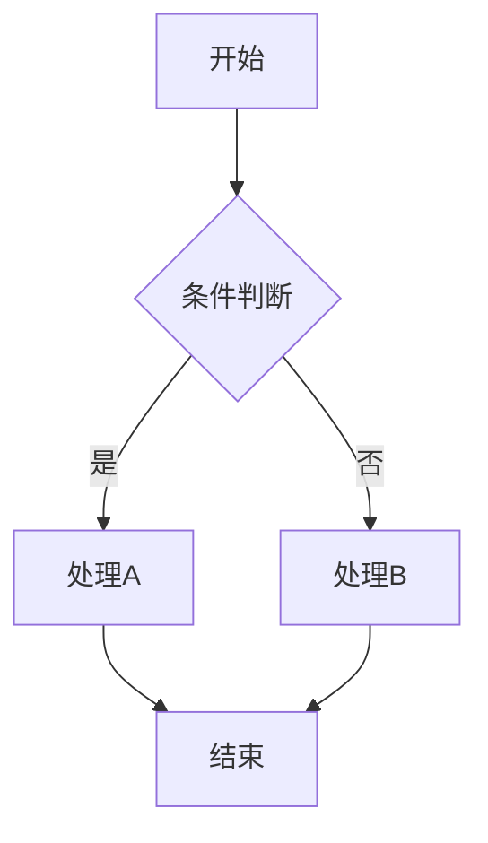
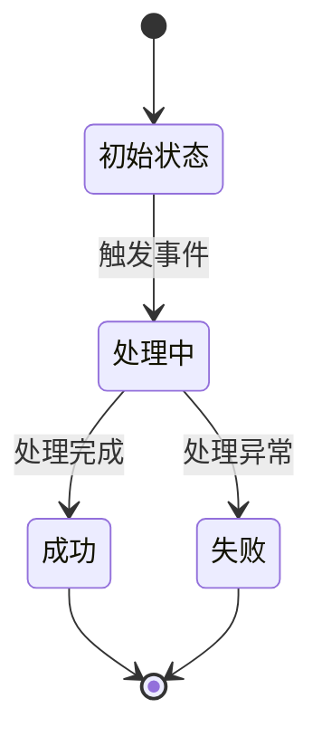
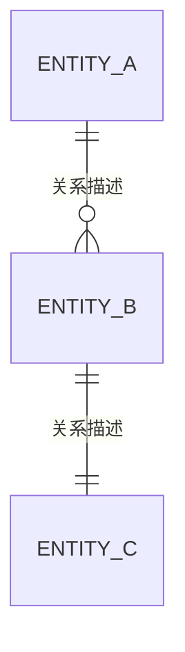

# 架构需求分析（PRD → 架构需求文档）

## 概述

将产品需求文档（PRD、Markdown、TXT 等）转换为用例驱动的架构需求文档。

---

## 输入要求

支持以下格式的需求输入：
- PRD 文档（产品需求文档）
- Markdown 文档
- 纯文本描述
- 口头需求描述

---

## 输出：架构需求文档

### 1. 业务概述
- 业务背景与目标
- 核心价值主张
- 业务边界定义

### 2. 参与者（Actors）

**识别规则**：
- 必须识别所有与系统交互的参与者
- **每个参与者必须关联至少 2 个用例**，否则不作为独立参与者
- 仅关联 1 个用例的角色应合并到其他参与者或作为用例的辅助角色

| 参与者 | 类型 | 描述 | 职责 | 关联用例数 |
|--------|------|------|------|------------|
| 示例：用户 | 内部 | 系统使用者 | 发起业务操作 | 5 |
| 示例：支付网关 | 外部 | 第三方支付系统 | 处理支付请求 | 3 |

**参与者类型**：
- 内部参与者：系统用户、管理员、运营人员等
- 外部参与者：第三方系统、API、消息队列等

**校验规则**：
- 列出参与者后，统计每个参与者关联的用例数量
- 关联用例数 < 2 的参与者需要重新评估：
  - 合并到其他参与者
  - 或作为用例中的辅助角色而非独立参与者

### 3. 用例（Use Cases）
```
用例编号: UC-001
用例名称: [用例名称]
参与者: [主要参与者]
前置条件:
  - 条件1
  - 条件2
主流程:
  1. 步骤1
  2. 步骤2
  3. 步骤3
备选流程:
  2a. 异常情况处理
后置条件:
  - 成功条件
  - 失败条件
业务规则:
  - 规则1
  - 规则2
```

### 4. 业务流程图
使用 Mermaid 流程图描述核心业务流程：


### 5. 状态机（State Machine）


| 状态 | 状态码 | 描述 | 可转换状态 |
|------|--------|------|------------|
| 初始状态 | INIT | 初始化 | 处理中 |
| 处理中 | PROCESSING | 正在处理 | 成功、失败 |

### 6. 事件（Events）
| 事件名称 | 触发条件 | 触发者 | 处理方式 | 影响范围 |
|----------|----------|--------|----------|----------|
| 示例事件 | 条件描述 | 参与者 | 同步/异步 | 影响的模块 |

### 7. 定时/周期任务
| 任务名称 | 执行周期 | 触发条件 | 任务内容 | 失败处理 |
|----------|----------|----------|----------|----------|
| 示例任务 | 每日00:00 | 自动触发 | 任务描述 | 重试策略 |

### 8. 外部依赖
| 依赖名称 | 类型 | 接口方式 | 用途 | 备注 |
|----------|------|----------|------|------|
| 示例依赖 | 二方RPC/三方API | Dubbo/HTTP | 用途描述 | 是否已对接 |

**依赖类型**：
- 二方 RPC：内部系统 Dubbo 接口
- 三方 API：外部系统 HTTP 接口
- 消息队列：MQ 消息订阅/发布
- 缓存服务：Redis 等

### 9. 关系图（实体关系）


### 10. 非功能性要求
| 类别 | 要求 | 指标 | 优先级 |
|------|------|------|--------|
| 性能 | 响应时间 | < 200ms | P0 |
| 可用性 | 系统可用率 | 99.9% | P0 |
| 安全性 | 数据加密 | AES-256 | P1 |
| 可扩展性 | 水平扩展 | 支持 | P1 |
| 可观测性 | 日志/监控 | 全链路 | P1 |

### 11. 业务约束
| 约束类型 | 约束内容 | 原因 | 影响 |
|----------|----------|------|------|
| 法规约束 | 示例约束 | 合规要求 | 影响描述 |
| 业务约束 | 示例约束 | 业务规则 | 影响描述 |
| 技术约束 | 示例约束 | 技术限制 | 影响描述 |

---

## 确认清单

完成架构需求文档后，需要与用户确认以下内容：

- [ ] 参与者是否完整？
- [ ] 用例是否覆盖所有业务场景？
- [ ] 状态流转是否正确？
- [ ] 外部依赖是否明确？
- [ ] 非功能性要求是否合理？
- [ ] 业务约束是否遗漏？

**确认后询问**: "架构需求文档已完成，是否确认继续生成技术方案文档？"
